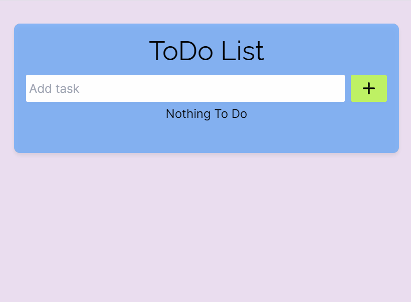

# ToDo List 🗒️
A simple ToDo List application built with [React.js](https://react.dev/), where users can add tasks and delete them once completed.

## Features 💡

- **Add Task**: Users can add tasks by typing in the input field and clicking the "Add" button or pressing the Enter key.
- **Delete Task**: Users can delete tasks by clicking the delete icon next to each task.
- **Task Count**: Displays the total number of tasks dynamically.

## Technologies ⚙️

## Overview 📱
